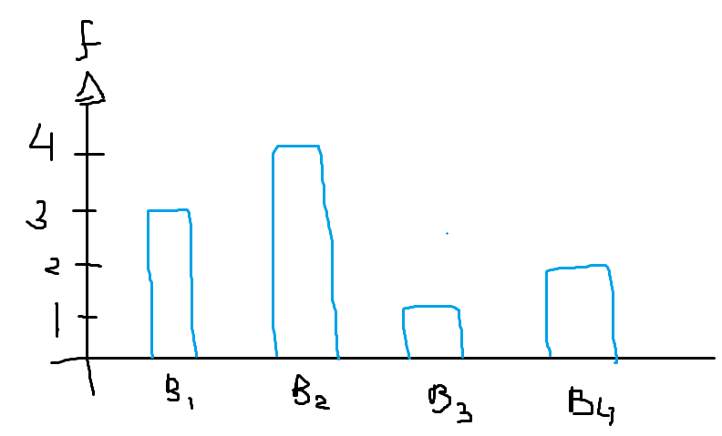
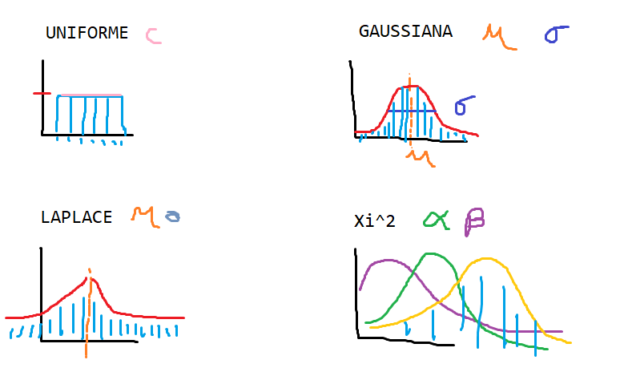
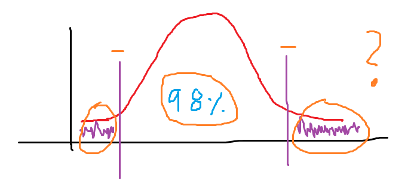

# Frecuencias, Conteos y Distribuciones

## Introducción

En un vector de datos, proveniente de una muestra, es común tener distintos tipos de datos:

* **Categorías:** Describen elementos finitos y etiquetados, cuya repetición es de uno o más elementos en cada categoría. Ejemplo: Etiquetas que describen un valor, como `HOMBRE`, `MUJER`, etc.
* **Valores Discretos:** Los cuales son generalmente números enteros o asociados a un índice y también se les suele llamar nominales. Ejemplo: Edad, Número de Casa, etc.
* **Valores Continuos:** Los cuales son generalmente números reales (continuos) y estos pueden ser infinitos incluso dentro de un intervalo. Por ejemplo, todos los valores entre 0 y 1. Ejemplo: Temperatura, Estatura, Peso, etc.

## Conteos

El conteo de valores sirve para indicar cuántos elementos están dentro de una misma categoría o un mismo intervalo (`bin`). Generalmente los conteos nos dirán cuántos elementos caen dentro de un grupo. El grupo es conocido como el intervalo/rango.

Para formar un intervalo/rango, necesitamos definir dos bordes o límites. Formalmente necesitamos un valor izquiero o límite inferior y un valor derecho o límite superior.

Los intervalos generalmente son contiguos y abiertos a los bordes. 

    EJEMPLO 
    
    Supongamos que tenemos mediciones de tornillos fabricados por la misma máquina. 
    Los tornillos idealmente deberían medir 1" (una pulgada).
    Sin embargo, es probable que algunos tornillos midan más o menos.
    Veamos diez muestras de las posibles mediciones de los tornillos.
    En este caso el vector sólo tendría dos ejes/columnas (ancho, alto).

    #  ALTO ANCHO
    1  1.01 0.24
    2  1.02 0.23
    3  0.99 0.24
    4  1.01 0.24
    5  1.00 0.24
    6  0.98 0.26
    7  1.01 0.24
    8  1.04 0.25
    9  0.97 0.24
    10 1.05 0.24

Cuándo nos efocamos en un solo eje, estamos hablando de un estudio unidimensional. Esto significa que no estableceremos relaciones con otros ejes (no haremos de momento correlaciones, indicadores, modelos, etc).

Si tomamos un solo eje del vector de datos de las muestras, tendremos una fila con el número de muestra como se muestra en siguiente ejemplo.

    ANÁLISIS DE ALTURAS (UNIDIMENSIONAL)

    ALTO: [10] 1.01 1.02 0.99 1.01 1.00 0.98 1.01 1.04 0.97 1.05

Lo principal para analizar un eje de datos, es comenzar por conteos, los cuáles se convertirán en frecuencias si asociamos intervalos/rangos.

El **primer paso** es ordenar los datos, dividirlos en intervalos y contar el número de veces que cada dato cae en un intervalo: 

    ANÁLISIS DE ALTURAS (UNIDIMENSIONAL)

    ALTO: [10] 0.97 0.98 0.99 1.00 1.01 1.01 1.01 1.02 1.04 1.05

En el **segundo paso** calculamos el `intervalo total`, que es un rango que establece el valor inferior como el valor mínimo de la muestra y el valor superior como el valor máximo de la muestra.

    ANÁLISIS DE ALTURAS (UNIDIMENSIONAL)

    ALTO: [10] 0.97 0.98 0.99 1.00 1.01 1.01 1.01 1.02 1.04 1.05

    INTERVALO T: (0.97, 1.05)

En **tercer paso** construímos los `bin`. Un `bin` (caja/cubeta/franja) es un sub-intervalo del `intervalo total`, el cuál tiene el mismo tamaño que el resto de `bins`. Podemos dividir el `intervalo total` en `N-Bins`.

    ANÁLISIS DE ALTURAS (UNIDIMENSIONAL)

    ALTO: [10] 0.97 0.98 0.99 1.00 1.01 1.01 1.01 1.02 1.04 1.05

    INTERVALO T: (0.97, 1.05) ~ 0.8

    BINS: 4 ~ 0.2  | 0.8 / 4 = 0.2

    INTERVALO B.1: (0.97, 0.99] ~ 0.2
    INTERVALO B.2: (0.99, 1.01] ~ 0.2
    INTERVALO B.3: (1.01, 1.03] ~ 0.2
    INTERVALO B.4: (1.03, 1.05) ~ 0.2

    * NOTA: El INTERVALO-T tiene una longitud de 0.8, entonces
    si deseamos 4 `bins`, cada uno debería medir 0.2.
    Es decir, el primer `bin` partiría de 0.97 e iríamos
    construyendo los siguientes `bins` de 0.2, en 0.2.

Como **cuarto paso**, el conteo en `bins` consiste entonces, en determinar cuántos elementos tiene cada `bin`. A esto se le conoce como *Frecuencias en Bins* o *Histograma*.

    ANÁLISIS DE ALTURAS (UNIDIMENSIONAL)

    ALTO: [10] 0.97 0.98 0.99 1.00 1.01 1.01 1.01 1.02 1.04 1.05

    INTERVALO B.1: (0.97, 0.99] >> 3 
    INTERVALO B.2: (0.99, 1.01] >> 4
    INTERVALO B.3: (1.01, 1.03] >> 1
    INTERVALO B.4: (1.03, 1.05) >> 2
    ----------------------------------
                                == 10

## Frecuencias

Las frecuencias de los elementos, ordenas en `bins` se conoce como el histograma, pero nos sirve no sólo visualmente, sino, que podemos conocer que distribución siguen los datos.

La distribución de los datos podría ir más allá de lo que se ve en el histograma y no basta con que visualmente parezca una distribución `uniforme`, `gaussiana`, `laplace` o alguna otra. Si no que tendremos que demostrar que dichos valores tienen esa distribución con un grado de significacia, para posteriormente poder realizar `estimadores`, `pruebas de hipótesis`, `análisis de la varianza`, `pruebas F/GAMMA`, etc.

## Distribuciones

Las distribuciones de datos, generalmente se apegan a modelos estandarizados, para poder extender la información de nuestro eje de análisis. Por ejemplo, si supieramos que los datos siguen una distribución `gaussiana` (`estándar`), entonces, podríamos crear indicadores, estimadores, simuladores.

> Ejemplo de las principales distribuciones

> La distribución gaussiana cómo rechazo a aceptación de hipótesis

## Ejercicios

1. Generar 20~100 muestras para un eje CATEGÓRICO (en al menos 4 categorías).
    - ¿De qué es el eje? (Ejemplo, género)
    - ¿Cuántos elementos hay en cada categoría?
    - ¿Qué diferencia hay entre una categoría y un `bin`?
2. Generar 20~100 muestras para un eje Discreto (por ejemplo, edades, número de hijos)
    - ¿De qué es el eje? (Ejemplo, número de embarazos)
    - Formar N `bins` y contar en cada `bin` cuántos elementos hay (N 4~10)
    - ¿Es posible llevar los datos discretos a categorías?
    - Convierte cada `bin` en una categoría (ponle un nombre) y determina la diferencia entre los `bins` y las categorías resultantes. (Pista: Piensa en las distribuciones, ¿Qué les pasaría?)

---

 Por [Alan Badillo Salas](https://github.com/dragonnomada)

Estudié **Matemáticas Aplicadas** en la Universidad Autónoma Metropolitana, posteriormente realicé una Maestría en **Inteligencia Artificial** en el Instituto Politécnico Nacional.

He impartido cursos de Programación Avanzada en múltiples lenguajes de programación, incluyendo *C/C++, C#, Java, Python, Javascript* y plataformas como *Android, IOS, Xamarin, React, Vue, Angular, Node, Express*. Ciencia de Datos en *Minería de Datos, Visualización de Datos, Aprendizaje Automático y Aprendizaje Profundo*. También sobre *Sistemas de administración basados en Linux, Apache, Nignx* y *Bases de Datos SQL y NoSQL* como MySQL, SQL Server y Mongo. Desde hace 7 años en varios instituciones incluyendo el *IPN-CIC, KMMX, The Inventor's House, Auribox*. Para diversos clientes incluyendo al **INEGI, CFE, PGJ, SEMAR, Universidades, Oracle, Intel y Telmex**.