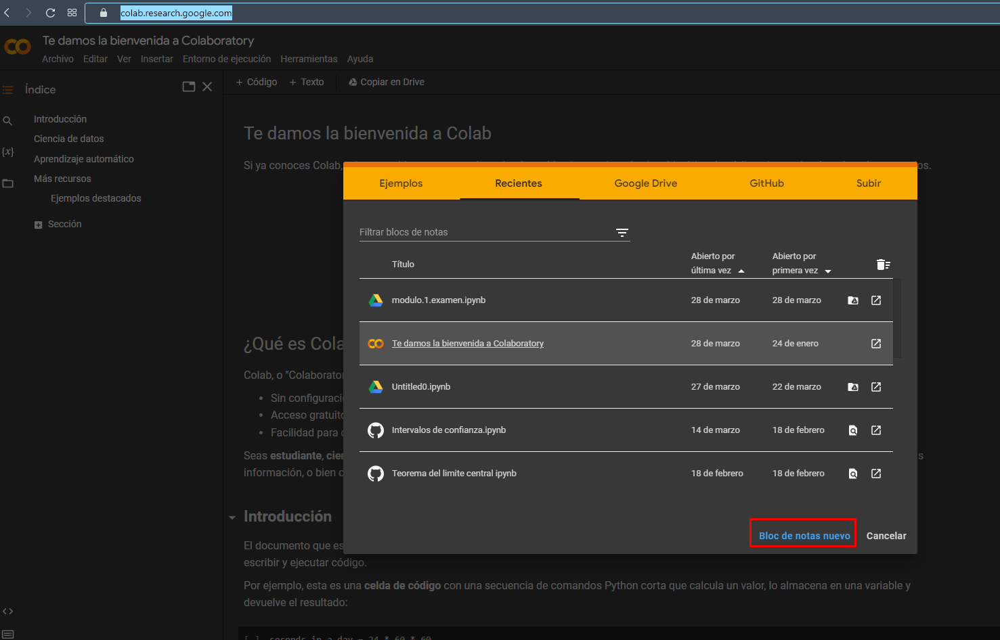
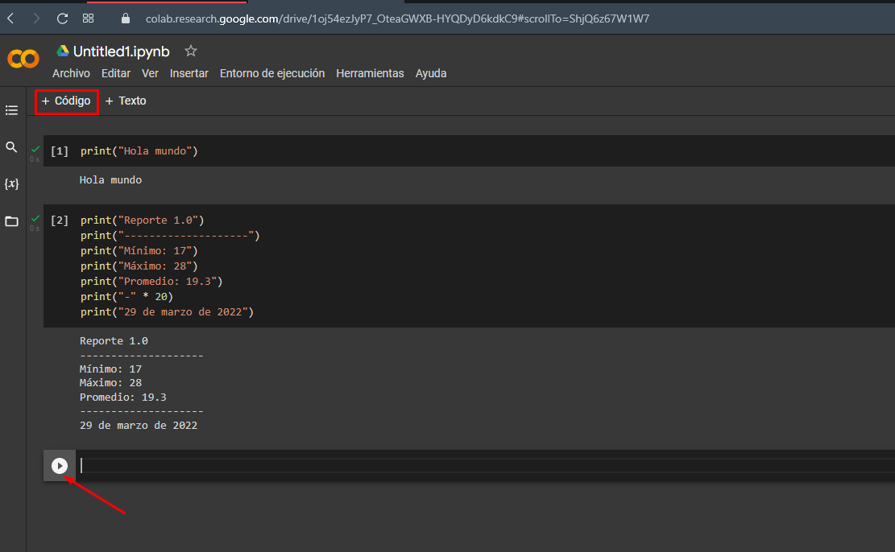

# Introducción a la Ciencia de Datos con Python

## Introducción

    ...

## Metodología ALEPVA

La metodología *ALEPVA* fue diseñada en el 2017 por *Alan Badillo Salas* para estructurar la forma en la que se debería aprender la Ciencia de Datos de una manera más didáctica. Consiste en enfocarse en cumplir los 6 pasos siguiente.

    Adquisición de Datos
    Limpieza de Datos
    Estructuración de Datos
    Procesamiento de Datos
    Visualización de Datos
    Automatización de Datos

La metodología no especifica los subtemas de cada paso, dando libertad al instructor de poder determinar los temas más importantes para cubrir cada paso, según las necesidades de los estudiantes. A continuación se muestran algunos temas que podrían abarcarse en cada paso.

    Adquisición de Datos

        - Desde archivos de texto con expresiones regulares
        - Desde archivos CSV
        - Desde archivos Excel
        - Desde Bases de Datos
        - Desde Páginas Web usando técnicas de raspado (scraping)
        - Desde Servicios Web API

    Limpieza de Datos

        - Quitar acentos, símbolos y marcadores en archivos de texto
        - Quitar muestras con datos degenerados en CSV y Excel
        - Normalizar datos malformados (por ejemplo, cambiar h o H por HOMBRE)
        - Separar datos (por ejemplo, una coordenada de latitud y longitud codificada)
        - Quitar ruido (por ejemplo, en imágenes, audio y videos)

    Estructuración de Datos

        - Extraer un dato
        - Extraer un vector de datos
        - Extraer una matriz de datos
        - Extraer un frame de datos
        - Extraer un dataframe de datos
        - Extraer un framelist de datos
        - Extraer una Serie de Pandas
        - Extraer un DataFrame de Pandas

    Procesamiento de Datos

        - Mapeo de datos
        - Filtro de datos
        - Reducción de datos

    Visualización de Datos

        - 1D (pasteles, barras, histogramas, etc)
        - 2D (puntos, series, mapas de calor, mapas espaciales, etc)
        - 3D (nube de puntos, superficies, barras en el espacio, etc)
        - MD (evolución en el tiempo, escenarios multidimensionales, etc)
        - Reportes de Texto (texto, pdf y excel)

    Automatización de Datos

        - Bots de Adquisición de datos
        - Bots de Limpieza de datos
        - Bots de Estructuración de datos
        - Bots de Procesamiento de datos
        - Bots de Visualización de Datos
        - Bots de Recolección y Creación de Bases de Datos
        - Bots Inteligentes

## Introducción a Python

    hola.py
    ---
    print("Hola mundo")
    ---

    reporte1.py
    ---
    print("Reporte 1.0")
    print("--------------------")
    print("Mínimo: 17")
    print("Máximo: 28")
    print("Promedio: 19.3")
    print("-" * 20)
    print("29 de marzo de 2022")
    ---

## Usar Colab

La plataforma de Google Colab nos permite crear libretas de código con Python. Se puede acceder gratuitamente con una cuenta de google.

[https://colab.research.google.com](https://colab.research.google.com)

---

 Por [Alan Badillo Salas](https://github.com/dragonnomada)

Estudié **Matemáticas Aplicadas** en la Universidad Autónoma Metropolitana, posteriormente realicé una Maestría en **Inteligencia Artificial** en el Instituto Politécnico Nacional.

He impartido cursos de Programación Avanzada en múltiples lenguajes de programación, incluyendo *C/C++, C#, Java, Python, Javascript* y plataformas como *Android, IOS, Xamarin, React, Vue, Angular, Node, Express*. Ciencia de Datos en *Minería de Datos, Visualización de Datos, Aprendizaje Automático y Aprendizaje Profundo*. También sobre *Sistemas de administración basados en Linux, Apache, Nignx* y *Bases de Datos SQL y NoSQL* como MySQL, SQL Server y Mongo. Desde hace 7 años en varios instituciones incluyendo el *IPN-CIC, KMMX, The Inventor's House, Auribox*. Para diversos clientes incluyendo al **INEGI, CFE, PGJ, SEMAR, Oracle, Intel, Telmex y Universidades**.