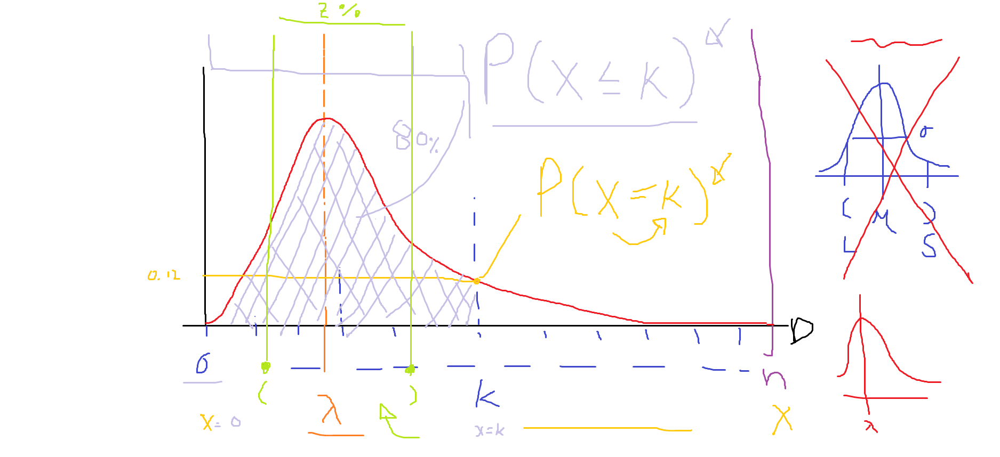
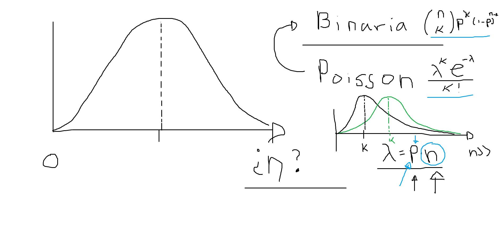

# Frecuencias, Conteos y Distribuciones

## Introducción

    ...

## Distribución Binaria

    DEFINICIÓN

    n - número de eventos
    p - probabilidad de que ocurra el evento
    i - número de eventos esperados

    X ~ Bin(n, p)

    P(X = i) = Combinaciones(n, i) p^i + (1 - p)^(n-i)

    Combinaciones(n, i) =         n!
                            ---------------
                              (n - i)! i! 

    EJEMPLO

    1)

    n - número camiones (5)
    p - probabilidad de que pase el camión deseado (0.14)
    i - número de camiones deseados (3)

    P(X = 3) = Combinaciones(5, 3) 0.18^3 (1 - 0.18)^(5-2)

    2)

    n - número de votantes (20)
    p - probabilidad de votar por el candidato deseado (0.12)
    i - número de vontantes que deseamos (4)

    P(X = 4) = Combinaciones(20, 4) 0.12^4 (1 - 0.12)^(20-4)

## Distribución Poisson

    DEFINICIÓN

    n - número máximo esperado de eventos (grande)
    k - número esperados de eventos
    p - probabilidad que ocurra un evento
    λ = p * n - es el valor esperado que ocurran los eventos (factor)

    X ~ Poisson(k, λ)

    P(X = k) =   λ^k e^(-λ)
                ------------
                     k!

    Nota: Aquí suponemos que tener una K grande,
    es similar una probabilidad cercana a cero.

    EJEMPLOS

    1)

    n - número máximo de clientes esperados que entren a una tienda (200)
    k - número esperado de clientes que compren ese día (40)
    p - probabilidad que compre un cliente (0.1)
    λ = p * n - probabilidad que compren todos los clientes (0.1 * 200 = 20)

    P(X = 40) =   (20)^40 e^(-20)
                -------------------
                       40!

    2)

    n - número de personas que pasan en la calle (5c)
    k - número esperado de personas que pueda entrevistar (3c)
    p - probabilidad que de entrevistar a una persona (0.5)
    λ = p * n - factor de entrevistar a las 50 personas (0.5 * 5c = 2.5c)

    P(X = 3c) =   (2.5)^3c e^(-2.5c)
                ---------------------
                       3c!

## Probabilidades acumuladas

Para una variable aleatoria `X`.

* ¿Cuál es la probabilidad que ocurra el evento `k`? `P(X = k)`
* ¿Cuál es la probabilidad que ocurran al menos `k` eventos? `P(X ≤ K) = P(X = 0) + P(X = 1) + ... + P(X = K)`

Con esto podemos determinar la probabilidad de P(A ≤ X ≤ B) = P(X ≤ B) - P(X ≤ A)`.

Ejemplo. La probabilidad de tener entre 5 y 10 compras del ejemplo de arriba.

Solución: `P(X = 5) + P(X = 6) + ... + P(X = 10)`.

## Tarea

Proponer un ejemplo aplicable a Poisson.

    Justificar los parámetros n, p, k, λ

Revisar la distribución normal

    n - número de muestras (xi continua)
    μ - promedio de las muestras [ (x0 + x1 + ... + xn) / n ]
    σ - desviación estándar √( ( (x0 - μ)^2 + (x1 - μ)^2 + ... + (xn - μ)^2 ) / n )

    X ~ Normal(μ, σ)

    P(X = x) =     1     e^-(x - σ)^2 / (2 σ^2)
                ---------
                 σ√(2π)

    EJEMPLO

    n - 10
    x - [0.8 3.9 2.7 5.3 2.98 3.67 1.8 2.1 4.5 3.2]
    μ - 30.95 / 10 = 3.095
    σ - √(( (0.8 - 3.095)^2 + (3.9 - 3.095)^2 + ... + (3.2 - 3.095)^2 ) / 10)

    x = 2.85

    P(X = x) = P(X = 2.85) =    1     e^-(x - σ)^2 / (2 σ^2)
                             ---------
                               σ√(2π)

Proponer un ejemplo aplicable a Gaussianas (Normales).

    Justificar los parámetros n, x, μ, σ

    Suponga dos límites `a` y `b`.

    P(a ≤ X ≤ b)

Revisar los estadísticos de [3. Estadísticos principales](./3.%20Estad%C3%ADsticos%20principales.md).

## Figuras

